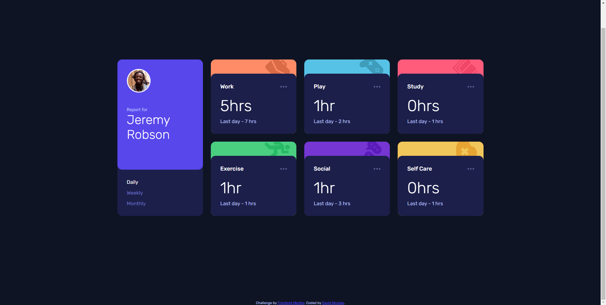

# Frontend Mentor - Time tracking dashboard solution

This is a solution to the [Time tracking dashboard challenge on Frontend Mentor](https://www.frontendmentor.io/challenges/time-tracking-dashboard-UIQ7167Jw). Frontend Mentor challenges help you improve your coding skills by building realistic projects. 

## Table of contents

- [Overview](#overview)
  - [The challenge](#the-challenge)
  - [Screenshot](#screenshot)
  - [Links](#links)
- [My process](#my-process)
  - [Built with](#built-with)
  - [What I learned](#what-i-learned)
  - [Useful resources](#useful-resources)
- [Author](#author)

## Overview

### The challenge

Users should be able to:

- View the optimal layout for the site depending on their device's screen size
- See hover states for all interactive elements on the page
- Switch between viewing Daily, Weekly, and Monthly stats

### Screenshot

### Links

- Solution URL: [code on GitHub](https://github.com/davnicolae/time-tracking-dashboard-FrontEnd-Mentor)
- Live Site URL: [live site on netlify pages](https://davnicolae-github-time-tracking-dashboard-frontend-mentor.netlify.app/)

## My process

I've used desktop-first design approach, therefore: 
- started creating base HTML structure 
- created layout using Grid & Flexbox
- added CSS styles
- added responsiveness using @media queries
- added basic functionality using Javascript 
- deployed result on GitHub pages

### Built with

- Semantic HTML5 markup
- CSS custom properties
- Flexbox
- CSS Grid
- Desktop-first workflow

## Author

- GitHub - [David Nicolae](https://github.com/davnicolae)
- Frontend Mentor - [@David Nicolae](https://www.frontendmentor.io/profile/davnicolae)
- Linkedin - [David Nicolae](https://www.linkedin.com/in/david-nicolae-b33845102/)
